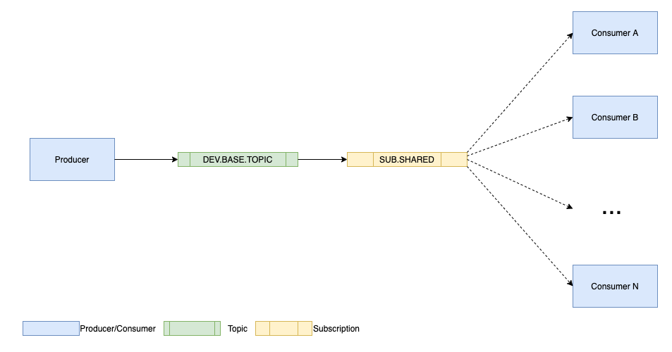
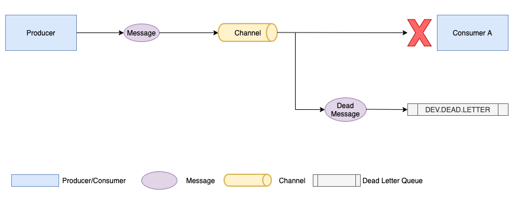
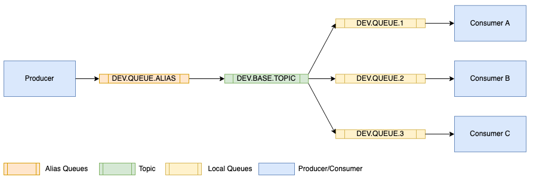
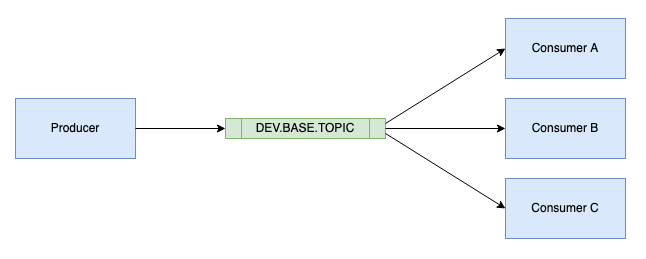
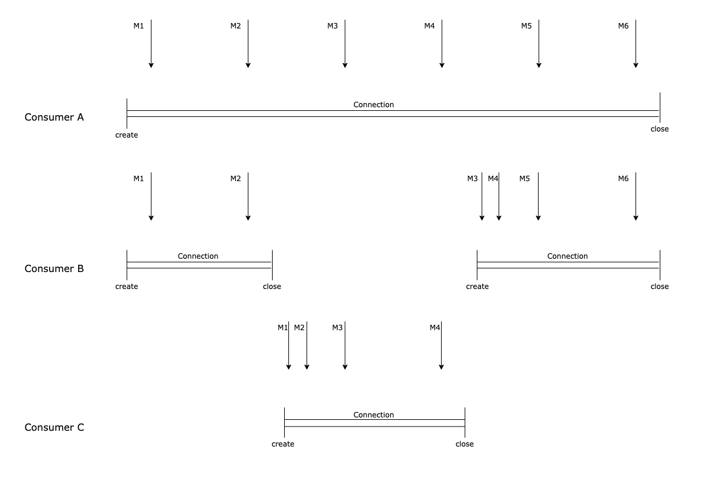
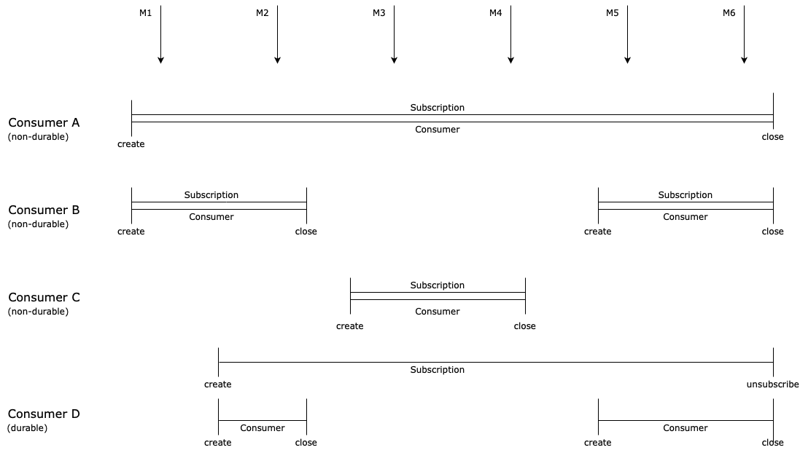
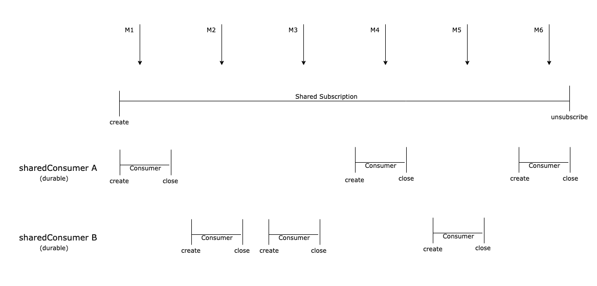

# MQ Showcase

Der Showcase besteht den Maven Projekten `mq-pubsub-queue-showcase` und `mq-pubsub-topic-showcase`. Jedes Maven Projekt eine Reihe von Modulen. Dabei handelt es sich um Java EE Anwendungen in Docker-Containern sowie je ein Testprojekt, in dem das Zusammenspiel der Java EE Anwendungen mit dem MQ Broker anhand mehrerer Tests gezeigt wird.

**MQ PubSub Queue Showcase (mq-pubsub-queue-showcase)**
Der Showcase enthält folgende Maven Module: 

*  `queue-producer` enthält einen JMS Producer für Queues 
*  `queue-consumer` enthält einen JMS Consumer für Queues
*  `queue-consumer-dlq` enthält einen JMS Consumer für Dead-Letter-Queues
*  `queue-testing` enthält eine Reihe von Integration-Tests zur Simulation des Zusammenspiels von Producer, Consumer und DLQConsumer.

Das Verzeichnis `config` enthält die Konfiguration für den MQ Broker. 

Die Konfiguration für die angebundene Queue bzw. die Dead Letter Queue kann beim Start der Docker Container als Environment-Variable übergeben werden.

Zum Bauen der Anwendung und zum Erzeugen der Docker Container muss der Befehl `mvn clean package` im Verzeichnis `mq-pubsub-queue-showcase` abgesetzt werden. Da die Ausführung der Tests mehrere Minuten in Anspruch nehmen kann, empfiehlt es sich ausgewählte Tests einzeln über die IDE auszuführen. Weitere Informationen zu den Tests finden sich im Abschnitt 5 Simulation. 

**MQ PubSub Topic Showcase (mq-pubsub-topic-showcase)**
Der Showcase enthält folgende Maven Module. 

*  `topic-producer` enthält einen JMS Producer für Topics
*  `topic-consumer` enthält einen JMS Consumer für Topics
*  `topic-consumer-durable` enthält einen JMS Consumer für durable Topics
*  `topic-consumer-shared` enthält einen JMS Consumer für Topics mit shared Subscriptions
*  `topic-consumer-dlq` enthält einen JMS Consumer für Dead-Letter-Queues
*  `topic-testing` enthält eine Reihe von Integration-Tests zur Simulation des Zusammenspiels von Producer, Consumer, DurableConsumer, SharedConsumer und DLQConsumer.

Das Verzeichnis `config` enthält die Konfiguration für den MQ Broker. 

Die Konfiguration für das angebundene Topic bzw. die Dead Letter Queue kann beim Start der Docker Container als Environment-Variable übergeben werden.

Zum Bauen der Anwendung und zum Erzeugen der Docker Container muss der Befehl `mvn clean package` im Verzeichnis `mq-pubsub-topic-showcase` abgesetzt werden. Da die Ausführung der Tests mehrere Minuten in Anspruch nehmen kann, empfiehlt es sich ausgewählte Tests einzeln über die IDE auszuführen. Weitere Informationen zu den Tests finden sich im Abschnitt 5 Simulation.

## 1 Pub/Sub

Message Broker wie IBM MQ erlauben die Entkopplung des Produzenten einer Information von den Konsumenten der Information. Der Vorteil einer entkoppelten Kommunikation besteht darin, dass die sendende Anwendung und die empfangene Anwendung nichts voneinander zu wissen brauchen, um Informationen zu senden und zu empfangen. Wie nahezu alle Message Broker ermöglicht IBM MQ unterschiedliche Arten von Kommunikation: Punkt-zu-Punkt sowie Publish/Subscribe - oftmals als _Pub/Sub_ abgekürzt.

Bevor eine Nachricht über eine Punkt-zu-Punkt Verbindung zwischen zwei Anwendungen verschickt werden kann, muss der Sender etwas über den Empfänger wissen - z.B. den Namen der Queue die der Empfänger konsumiert sowie das Nachrichtenformat, dass der Empfänger versteht. Eine Punkt-zu-Punkt Verbindung wird daher durch den Empfänger bestimmt. Darüber hinaus kann eine Nachricht nur von einer einzigen konsumierenden Anwendung verarbeitet werden.

Pub/Sub beschreibt einen Mechanismus, beim dem Empfänger Informationen in Form von Nachrichten von Sendern empfangen können. Sender - im Umfeld asynchroner Kommunikation allgemein als Produzenten bezeichnet - von Informationen wird im Kontext von Pub/Sub als _Publisher_ bezeichnet. Publisher stellen Informationen in Form von Nachrichten (_Publication_) zu einem Thema (_Topic_) zur Verfügung. Empfänger - im Umfeld asynchroner Kommunikation allgemein als Konsumenten bezeichnet - der Informationen werden im Kontext von Pub/Sub als _Subscriber_ bezeichnet. _Subscriber_ die sich für Informationen zu einem bestimmten Thema (_Topic_) interessieren, können diese abonnieren, in dem sie eine _Subscription_ für das jeweilige _Topic_ erstellen. Ein _Subscriber_ kann durchaus mehrere _Subscriptions_ abschließen und somit Informationen von vielen verschiedenen _Publishern_ zu unterschiedlichen Themen erhalten. Im Unterschied zur Punkt-zu-Punkt Verbindung hebt Pub/Sub - durch den Einsatz von Topics - die Notwendigkeit für den Sender auf, etwas über den Empfänger wissen zu müssen. Gleichzeitig muss der Empfänger nichts über die Quelle der Information zu wissen. Ein weiterer signifikanter Unterschied ist, dass eine Nachricht, die auf einem Topic veröffentlicht wird, von allen interessierten Empfängern verarbeitet werden kann.

_weitere Information zu Pub/Sub_
*   [Publish/Subscribe Pattern](https://en.wikipedia.org/wiki/Publish–subscribe_pattern)
*   [IBM MQ 9.0.x - Publish/Subscribe Messaging](https://www.ibm.com/support/knowledgecenter/SSFKSJ_9.0.0/com.ibm.mq.pro.doc/q004870_.htm)


### 1.1 Subscribers & Subscriptions

Ein typisches Pub/Sub System besteht i.d.R. aus 1-n Publishern und 1-n Subscribern sowie einer Vielzahl unterschiedlicher Topics. Bei IBM MQ werden sämtlichen Interaktionen zwischen Publishern und Subscribern durch einen bzw. mehrere Queue-Manager gesteuert. Der Queue-Manager empfängt Nachrichten von Publishern und Subscriptions von Subscribern zu einer Reihe von Topics. Die Aufgabe des Queue-Manager besteht darin, die veröffentlichten Nachrichten an die Subscriber weiterzuleiten, die eine Subscription für das jeweiligen Topic erstellt haben. Eine Subscription kann entweder von einer Anwendung oder manuell (via MQSC Command) an den lokalen Queue-Manager gestellt werden. In der Subscription ist definiert für welches Topic oder welchen Topic-Baum (die Verwendung von Wildcard ist möglich) sich der Subscriber interessiert. Des weiteren können folgende Parameter festgelegt werden

*   ein optionaler Selection-String um nach Publikation mit bestimmten Eigenschaften zu filtern
*   eine optionale Subscriber Queue, in der die Publikationen abgelegt werden
*   sowie eine ebenfalls optionale Correlation-ID. 

Erhält der lokale Queue-Manager eine Publikation, prüft er ob eine oder mehrere Subscriptions für das zugehörige Topic existieren und die Publikation den definierten Filter-Kriterien (Selection-String) entspricht. Falls ja, leitet er die Publikation in die jeweiligen Subscriber Queues.

_weitere Information zu Subscribern & Subscriptions_
*   [IBM MQ 9.0.x - Publish/Subscribe Components](https://www.ibm.com/support/knowledgecenter/SSFKSJ_9.0.0/com.ibm.mq.pro.doc/q004890_.htm)
*   [IBM MQ 9.0.x - Subscribers and subscriptions](https://www.ibm.com/support/knowledgecenter/SSFKSJ_9.0.0/com.ibm.mq.pro.doc/q004950_.htm)

#### 1.1.1 Durable & Non-Durable Subscriptions

Eine Subscription kann als durable (dauerhaft) oder non-durable (nicht dauerhaft) Subscription konfiguriert werden. Die Konfiguration der Subscription bestimmt, was mit der Subscription geschieht, wenn die Verbindung der Subscriber Anwendung zum Queue-Manager getrennt wird. 

Wie der Name vermuten lässt, bleibt eine durable Subscription bestehen, wenn die Verbindung der Subscriber Anwendung zum Queue-Manager getrennt wird. Die Subscription bleibt auch nach dem Trennen der Verbindung bestehen und kann durch die Subscriber Anwendung wiederhergestellt werden. Um eine durable Subscription herzustellen, muss die Subscriber Anwendung beim Erstellen der Subscription einen eindeutigen Namen (`SubName`) festlegen und diesen bei jedem Verbindungsaufbau übergeben. Wird eine durable Subscription nicht länger benötigt, kann diese durch die Subscriber Anwendung oder manuell über den Queue Manager gelöscht werden.

Solange eine durable Subscription besteht, werden Publikationen in die Subscriber Queue weitergeleitet auch wenn die Verbindung der Subscriber Anwendung zum Queue-Manager getrennt ist. Bleibt die Verbindung über einen längeren Zeitraum getrennt, können eine Vielzahl von nicht verarbeiteten Publikationen in der Subscriber Queue auflaufen. Dies kann im schlechtesten Fall zu einem Speicherüberlauf und dem Absturz des Queue-Managers führen. Um dieses Problem zu vermeiden, empfiehlt es sich non-durable Subscriptions wann immer sinnvoll möglich zu verwenden.

Eine non-durable Subscription besteht nur solange wie Verbindung der Subscriber Anwendung zum Queue-Manager besteht. Wird die Verbindung zum Queue-Manager getrennt, wird die Subscription automatisch entfernt und keine weiteren Publikationen an die Subscriber Queue weitergeleitet.

_weitere Information zu Durable & Non-Durable Subscriptions_
*   [IBM MQ 9.0.x - Managed queues and publish/subscribe](https://www.ibm.com/support/knowledgecenter/SSFKSJ_9.0.0/com.ibm.mq.pro.doc/q004960_.htm)
*   [IBM MQ 9.0.x - Subscription durability](https://www.ibm.com/support/knowledgecenter/SSFKSJ_9.0.0/com.ibm.mq.pro.doc/q004970_.htm)

#### 1.1.2 Cloned & Shared Subscription


    
IBM MQ unterstützt zwei Methoden - durch die Verwendung geklonter (cloned) oder gemeinsam genutzter (shared) Subscriptions - um mehreren Subscribern Zugriff auf dieselbe Subscription zu gewähren. Was auf den ersten Blick, wie ein Widerspruch zum Pub/Sub Mechanismus aussieht, deckt einen praktischen Bedarf insbesondere von Anwendungen die mit mehreren Instanzen betrieben werden. Werden für eine Anwendung mehrere Instanzen betrieben, würden in einem Pub/Sub-System die Nachricht n mal konsumiert und verarbeitet. Mittels geklonter oder shared Subscription wird hingegen jede Nachricht von jeder Anwendung nur einmal verarbeitet.
    
Geklonte Subscriptions sind eine IBM MQ Erweiterung, die mehreren Verbrauchern in verschiedenen JVMs gleichzeitigen Zugriff auf die Subscription ermöglicht. Sie können nur bei durable Subscriptions aktiviert werden. Eine durable Subscription kann als geklont betrachtet werden, wenn ein oder mehrere Subscriber unter Angabe demselben Subscription Name erstellt wurden. Wird eine Nachricht auf dem Topic der Subscription veröffentlicht, wird eine Kopie dieser Nachricht an die Subscription gesendet. Die Nachricht steht jedem der Subscriber zur Verfügung, wird aber nur von einem empfangen.

Mit JMS 2.0 wurden shared Subscriptions eingeführt, die es mehreren Subscribern einer Topic Subscription ermöglichen, eine Nachrichten gemeinsam zu nutzen. Jede Nachricht aus der Subscription wird anstatt allen nur einem Subscriber zugestellt. Shared Subscriptions können sowohl für durable als auch non-durable Subscriptions erstellt werden.

_weitere Information zu Shared Subscriptions_
*  [IBM MQ 9.0.x - Cloned & Shared Subscriptions](https://www.ibm.com/support/knowledgecenter/SSFKSJ_9.0.0/com.ibm.mq.dev.doc/q119140_.htm)


### 1.2 Topics

Ein Topic beschreibt das Thema der Informationen, zu dem Nachrichten über das jeweilige Topic versendet werden. Will ein Publisher eine Publikation versenden, gibt er das Topic in Form eines Topicstrings an. Um diese und weitere Publikationen zu erhalten, muss ein Subscriber beim Erstellen einer Subscription einen `passenden` Topicstring angeben. Als Topicstring kann sowohl der exakte Namen des Topics als auch ein Muster mit Platzhaltern verwendet werden, das zum Topic der Publikation passt. Letztere sind im Zusammenhang mit Topic-Trees von Bedeutung.

In größeren Organisation werden Themen hierarchisch in Topic-Trees organisiert. Während ein Publisher eine Publikation immer an ein ausgewähltes Topic z.B. `/huk/kfz/pkw` sendet, kann ein Subscriber eine Subscription auf einen Topic-Tree, i.d.R. einen Teilbaum bestehend aus mehreren hierarchisch angeordneten Topics z.B. `/huk/kfz/+` erstellen. In diesem Fall leitet der Queue-Manager nicht nur Publikationen des Topic `/huk/kfz/pkw` sondern auch für die Topics `/huk/kfz/motorad` und `/huk/kfz/wohnwagen` an den Subscriber weiter.

_weitere Information zu Topics_
*   [IBM MQ 9.0.x - Topics](https://www.ibm.com/support/knowledgecenter/SSFKSJ_9.0.0/com.ibm.mq.pro.doc/q004990_.htm)
*   [IBM MQ 9.0.x - Topic strings](https://www.ibm.com/support/knowledgecenter/SSFKSJ_9.0.0/com.ibm.mq.pro.doc/q005000_.htm)
*   [IBM MQ 9.0.x - Topic trees](https://www.ibm.com/support/knowledgecenter/SSFKSJ_9.0.0/com.ibm.mq.pro.doc/q005050_.htm)


### 1.3 Alias Queue

IBM MQ bietet die Möglichkeit Alias-Queues definieren, um indirekt auf eine andere Queue oder ein Topic zu verweisen. Eine Alias-Queue ist keine echte Queue, sondern ein Verweis, der zur Laufzeit in eine lokale bzw. entfernte Queue oder ein Topic aufgelöst wird. Alias-Queue sind nützlich um ...

*   Anwendungen unterschiedliche Zugriffsberechtigungen auf eine Queue oder ein Topic zu geben
*   Anwendungen zu ermöglichen auf unterschiedliche Weise (z.B. verschiedene Prioritäten) mit derselben Queue oder demselben Topic arbeiten können
*    die Wartung, Migration oder die Lastverteilung für eine Queue oder ein Topic zu vereinfachen

Ein typischer Anwendungsfall für Alias-Queues ist die Namensänderungen einer Queue oder eines Topics. Mit Hilfe der Alias-Queue können Anwendungen ohne Anpassung mit der umbenannten Queue oder dem Topic kommunizieren.

_weitere Information zu Fehlerhandling_
*   [IBM MQ 9.0.x - Alias Queues](https://www.ibm.com/support/knowledgecenter/SSFKSJ_9.0.0/com.ibm.mq.pro.doc/q003120_.htm)
*   [IBM MQ 9.0.x - Working with alias queues](https://www.ibm.com/support/knowledgecenter/SSFKSJ_9.0.0/com.ibm.mq.adm.doc/q020820_.htm)


### 1.4 Dead Letter Queue

Wenn eine Nachricht nicht zugestellt werden kann, kann im Unterschied zur synchronen Kommunikation der Publisher nicht aufgefordert werden, die Nachricht zu einem späteren Zeitpunkt erneut zu Versenden. Abhilfe bietet eine Queue für unzustellbare Nachrichten _Dead Letter Queue_, kurz _DLQ_, genannt. Im Falle eines Fehlers können Nachrichten durch den Queue-Manager oder eine Anwendung in die DLQ verschoben werden. Typische Fehlerfälle sind Subscriber, die eine Nachricht wiederholt nicht verarbeiten können. Damit der Subscriber nicht dauerhaft blockiert wird, wird die Nachricht nach einer definierten Zahl von Zustellversuchen ausgesteuert und in die DLQ verschoben.



_weitere Information zu Fehlerhandling_
*   [IBM MQ 9.0.x - Safety of messages](https://www.ibm.com/support/knowledgecenter/SSFKSJ_9.0.0/com.ibm.mq.con.doc/q015720_.htm)
*   [IBM MQ 9.0.x - Dead-letter queues](https://www.ibm.com/support/knowledgecenter/SSFKSJ_9.0.0/com.ibm.mq.pro.doc/q002680_.htm)
*   [IBM MQ 9.0.x - Working with dead-letter queues](https://www.ibm.com/support/knowledgecenter/SSFKSJ_9.0.0/com.ibm.mq.adm.doc/q020730_.htm)


## 2 Pub/Sub in der Praxis

Mit IBM MQ kann Pub/Sub auf zwei Arten realisiert werden - mit Topics oder mit Queues. Nachfolgend werden diese beiden Möglichkeiten dargestellt.


## 2.1 Pub/Sub mit Queues



Die Abbildung zeigt ein Pub/Sub System mit einem Publisher (Producer) und drei Subscribern (Consumer A/B/C) die über eine Alias Queue, ein Topic sowie drei Queues (eine je Consumer) kommunizieren. Der Producer _(vgl. Maven Modul queue-producer)_ und die Consumer _(vgl. Maven Modul queue-consumer)_ sind Java EE Anwendungen die Nachrichten über Queues austauschen. Die Publisher Anwendung (Producer) sendet Nachrichten an die Alias Queue. Diese werden an das Topic `DEV.BASE.TOPIC` weitergeleitet. Für jede Queue  `DEV.QUEUE.1`, `DEV.QUEUE.2` und `DEV.QUEUE.3` wird eine Subscription auf dem Topic erstellt, welche dafür sorgt, dass die Nachricht vom Topoi an die jeweilige Queue weiterleitet_._ An jeder Queue liest eine Consumer Anwendung die eingehenden Nachrichten. 

Vor dem Versenden der ersten Nachricht müssen die Alias Queue, das Topic sowie eine Queue für jeden Subscriber im Queue-Manager konfiguriert werden. Für jeden weiteren Subscriber muss eine zusätzliche Queue konfiguriert werden.


### 2.2 Pub/Sub mit Topics



Die Abbildung zeigt ein Pub/Sub System mit einem Publisher (Producer) und drei Subscribern (Consumer A/B/C) die über Topic kommunizieren. Der Producer _(vgl. Maven Modul topic-producer)_ und die Consumer _(vgl. Maven Module topic-consumer bzw. durable-topic-consumer)_ sind Java EE Anwendungen, die Nachrichten über Topics austauschen. Die Publisher Anwendung (Producer) sendet Nachrichten an das Topic `DEV.BASE.TOPIC`. Diese werden an alle Subscriber Anwendungen (Consumer A/B/C) weitergeleitet, die eine Subscription auf dem Topic haben. 

Vor dem Versenden der ersten Nachricht muss das Topic im Queue-Manager konfiguriert werden. Weitere Subscriber Anwendungen können selbstständig und ohne zusätzlichen Konfigurationsaufwand eine Subscription auf den Topic erstellen.


## 3 MQ Konfiguration

### 3.1 Queue erstellen

Ein Queue Objekt kann über das das MQ Dashboard (Admin-UI) oder über ein MQSC Kommando (via Command Line Interface). Alias Queues und Subscriptions hingegen können nicht über das MQ Dashboard sondern nur über MQSC Kommandos erstellt werden. Nachfolgend werden die MQSC Befehle dargestellt.

**Alias Queue erstellen (init.mqsc)**
```MQSC
DEFINE QALIAS(DEV.QUEUE.ALIAS) TARGTYPE(TOPIC) TARGET(DEV.BASE.TOPIC)
```

Alias Queues können sowohl Queues als auch Topics als Ziel haben. Mit `QALIAS(DEV.QUEUE.ALIAS)` definiert man den Namen der Queue. Zusätzlich muss man mit `TARGTYPE(TOPIC) TARGET(DEV.BASE.TOPIC)` den Typ und das Ziel der Alias Queue definieren.


**Subscriptions erstellen (init.mqsc)**
```MQSC
DEFINE SUB(SUB.1) DEST(DEV.QUEUE.1) TOPICOBJ(DEV.BASE.TOPIC)
DEFINE SUB(SUB.2) DEST(DEV.QUEUE.2) TOPICOBJ(DEV.BASE.TOPIC)
DEFINE SUB(SUB.3) DEST(DEV.QUEUE.3) TOPICOBJ(DEV.BASE.TOPIC)
```
Subscriptions benötigen eine Destination Queue und ein Topic als Quelle. Mit `SUB(SUB.1)` definiert man den Namen der Subscription. Zusätzlich muss man mit `DEST(DEV.QUEUE.1) TOPICOBJ(DEV.BASE.TOPIC)` Ziel und Quelle für die Subscription definieren.

#### 3.1.1 Dead Letter Queue für Queues erstellen

_Dead Letter Queues_ sind normale _local queues_, die genau wie diese erzeugt werden können. Damit der _Queue Manager_ eine nicht zustellbare Nachricht auch in die neue Dead Letter Queue sendet, muss dies zusätzlich konfiguriert werden.
```mqsc
DEFINE QLOCAL(QUEUE.DEAD.LETTER)
ALTER QMGR DEADQ('QUEUE.DEAD.LETTER')

ALTER QLOCAL(DEV.QUEUE.1) BOTHRESH(2) BOQNAME(QUEUE.DEAD.LETTER)
ALTER QLOCAL(DEV.QUEUE.2) BOTHRESH(2) BOQNAME(QUEUE.DEAD.LETTER)
ALTER QLOCAL(DEV.QUEUE.3) BOTHRESH(2) BOQNAME(QUEUE.DEAD.LETTER)
``` 

### 3.2 Topic erstellen

Ein Topic Objekt kann über das das MQ Dashboard (Admin-UI) oder über ein MQSC Kommando (via Command Line Interface) erstellt werden. Nachfolgend wird der MQSC Befehl dargestellt.

**Topic erstellen (init.mqsc)**
```MQSC
DEFINE TOPIC(DEV.BASE.TOPIC) TOPICSTR('dev/')
```

Mit `TOPIC(DEV.BASE.TOPIC)` definiert man den Namen des Topics. `TOPICSTR('dev/')` erstellt einen Topicstring, anhand dessen Subscriptions zwischen Topics unterscheiden können.

#### 3.2.1 Dead Letter Queue für Topics erstellen

Bei Topics unterscheidet sich der Umgang mit nicht zustellbaren Nachrichten, da die Art der Subscription - durable bzw. non-durable - bei der Konfiguration berücksichtigt werden muss.

Anstelle einer _local Queue_ wird eine _managed Queue_ erstellt, die für durable (`SYSTEM.NDURABLE.MODEL.QUEUE`) und non-durable Subscriptions (`SYSTEM.DURABLE.MODEL.QUEUE`) konfiguriert werden kann.

```mqsc
DEFINE QLOCAL('BASE.DEAD.LETTER')
ALTER QMODEL(SYSTEM.DURABLE.MODEL.QUEUE) BOTHRESH(2) BOQNAME(BASE.DEAD.LETTER)
ALTER QMODEL(SYSTEM.NDURABLE.MODEL.QUEUE) BOTHRESH(2) BOQNAME(BASE.DEAD.LETTER)
```

_weiter Informationen zu Dead Letter Queues bei Topics_
* [Handling poison messages in IBM MQ classes for JMS](https://www.ibm.com/support/knowledgecenter/SSFKSJ_8.0.0/com.ibm.mq.dev.doc/q032280_.htm)


## 4 JMS-Integration in Open Liberty

Asynchrone Kommunikation in der Java-Welt erfolgt oftmals über JMS (Java Message Service). JMS ist eine standardisierte API für Messaging Systeme, die es Java EE Anwendungen ermöglicht, Nachrichten zu Erstellen, zu Senden, zu Empfangen und zu Lesen. JMS existiert bereits seit 2002 als Teil der Java Enterprise Plattform, jetzt Jakarta EE und wurde 2013 mit Java EE 7 grundlegend überarbeitet. Achtung: Anders als in vielen Fällen dargestellt, ist JMS kein standardisiertes Protokoll und legt auch kein Message-Format fest. Die Verwendung von JMS ermöglicht keineswegs den Einsatz heterogener Messaging-Systeme, sondern bildet lediglich eine Abstraktionsschicht auf die proprietären APIs der verschiedenen Message Broker. Das hat in der Regel zur Folge, dass unterschiedliche JMS Implementierung nicht interoperabel sind und somit auch nicht gemeinsam genutzt werden können.

Damit JMS genutzt von Java  werden kann, ist ein externer Provider erforderlich, der die JMS API implementiert und die Verbindung zum Message Broker bereitstellt. Bevor ein Java EE Application Server wie Open Liberty oder Wildfly mit einem Message Broker wie IBM MQ kommunizieren kann, muss der Application Server um einen produktspezifischen Resource Adapter erweitert werden.

Resource Adapter (.rar) sind Systembibliotheken, die die Konnektivität zwischen einem Application Server und einem Enterprise Information System (z.B. einem Message Broker) - kurz EIS - sicherstellen. Ein Resource Adapter für einen Message Broker ist quasi das Pendant zu einem produktspezifischen JDBC-Treiber für ein Datenbankmanagementsystem (z.B. IBM DB2 oder Oracle DB). Der Resource Adapter stellt die nahtlosen Verbindung zwischen EIS, Application Server und der Java EE Anwendung sicher.

In einem Application Server können mehrere Resource Adapter konfiguriert werden, um den ausgeführten Anwendungen Zugriff auf das jeweilige EIS zu gewähren. Der Application Server und das EIS arbeiten zusammen um alle Mechanismen auf Systemebene - Transaktionen, Sicherheit und Verbindungsverwaltung - für die ausgeführten Anwendung transparent bereitzustellen. Der Vorteil besteht darin, dass sich die ausgeführten Anwendung vollständig auf die Abbildung der Geschäftslogik konzentrieren kann und sich nicht um die mit der EIS-Integration verbundenen Probleme auf Systemebene kümmern muss.

weitere Informationen zu Resource Adaptern
* [Programming Resource Adapters](https://docs.oracle.com/cd/E13222_01/wls/docs92/resadapter/understanding.html)

### 4.1 Installation

Um auf einen IBM MQ Message Broker zuzugreifen, muss zunächst der Resource Adapter (_wmq.jmsra-9.1.4.0.rar_) im Open Liberty Server installiert werden. Hierzu wird der Resource-Adapter mit Hilfe von Maven während des Build-Prozesses in das _shared resources_ Verzeichnis des Open Liberty Application Servers kopiert (vgl. `target/liberty/wlp/usr/shared/resources`). Dabei handelt es sich um ein spezielles Verzeichnis für externe Bibliotheken, das Open Liberty beim Starten automatisch überwacht und alle dort befindlichen Bibliotheken installiert.

### 4.2 Konfiguration

Darüber hinaus muss der Resource Adapter in der server.xml konfiguriert werden. 

```xml
<resourceAdapter id="wmqjmsra" location="${shared.resource.dir}wmq.jmsra-9.1.4.0.rar"/>
```

#### 4.2.1 Queue Konfiguration

Damit ein Producer Nachrichten an eine Queue senden kann, muss eine _ConnectionFactory_ und ein _Queue_ Objekt definiert werden. Die _jmsConnectionFactory_ definiert den Host und Port vom IBM MQ mit dem zur Queue zugehörigen Queue Manager und Channel.

```xml
<jmsConnectionFactory jndiName="JMSFactory">
  <properties.wmqjmsra
    transportType="CLIENT"
    hostName="${ibm.host}"                                              <!-- mq -->
    port="${ibm.port}"                                                  <!-- 1414 -->
    channel="${ibm.channel}"                                            <!-- DEV.ADMIN.SVRCONN -->
    queueManager="${ibm.qManager}"/>                                    <!-- QM1 -->
  <containerAuthData
    user="${secret.user}"                                               <!-- admin -->
    password="${secret.pass}"/>                                         <!-- passw0rd -->
</jmsConnectionFactory>
```

Für die Queue muss ein JNDI Name, mit dem JMS die Queue finden kann, erstellt werden.  
Außerdem wird ein _baseQueueName_ definiert, der den Namen der Queue beeinhaltet.

```xml
<jmsQueue id="jms/mdbq" jndiName="JMSQueue">
  <properties.wmqjmsra
    baseQueueName="${ibm.queue}"                                        <!-- DEV.QUEUE.ALIAS -->
    baseQueueManagerName="${ibm.qManager}"/>                            <!-- QM1 -->
</jmsQueue>
```

Für einen Consumer muss zusätzlich eine _jmsActivationSpec_ in der `server.xml` konfiguriert werden. Damit werden die Konfigurationen für die **Message Driven Beans** definiert.

```xml
<jmsActivationSpec id="queue-consumer/QueueConsumer">
  <properties.wmqjmsra
    destinationRef="jms/mdbq"
    destinationType="javax.jms.Queue"
    transportType="CLIENT"
    hostName="${ibm.host}"                                              <!-- mq -->
    port="${ibm.port}"                                                  <!-- 1414 -->
    channel="${ibm.channel}"                                            <!-- DEV.ADMIN.SVRCONN -->
    queueManager="${ibm.qManager}"/>                                    <!-- QM1 -->
  <containerAuthData
    user="${secret.user}"                                               <!-- admin -->
    password="${secret.pass}"/>                                         <!-- passw0rd -->
</jmsActivationSpec>
```

#### 4.2.2 Topic Konfiguration

Die Konfiguration für ein Topic erfolgt analog zur Queue. Statt der _jmsConnectionFactory_ und der _jmsQueue_ muss eine _jmsTopicConnectionFactory_ und ein _jmsTopic_ definiert werden.

```xml
<jmsTopicConnectionFactory jndiName="JMSTopicFactory">
  <properties.wmqjmsra
    transportType="CLIENT"
    hostName="${ibm.host}"                                              <!-- mq -->
    port="${ibm.port}"                                                  <!-- 1414 -->
    channel="${ibm.channel}"                                            <!-- DEV.ADMIN.SVRCONN -->
    queueManager="${ibm.qManager}"/>                                    <!-- QM1 -->
  <containerAuthData
    user="${secret.user}"                                               <!-- admin -->
    password="${secret.pass}"/>                                         <!-- passw0rd -->
</jmsTopicConnectionFactory>
```

Für das Topic muss ein JNDI Name, mit dem JMS den Topic finden kann, erstellt werden.  
Außerdem wird ein _baseTopicName_ definiert, der den Topicnamen beeinhaltet.

```xml
<jmsTopic id="jms/mdbq" jndiName="JMSTopic">
    <properties.wmqjmsra baseTopicName="${ibm.topic}"/>                 <!-- DEV.BASE.TOPIC -->
</jmsTopic>
```

Für einen Subscriber muss zusätzlich eine _jmsActivationSpec_ in der `server.xml` konfiguriert werden. Damit werden die Konfigurationen für die **Message Driven Beans** definiert.

```xml
<jmsActivationSpec id="topic-consumer/TopicConsumer">
  <properties.wmqjmsra
    destinationRef="jms/mdbq"
    destinationType="javax.jms.Topic"
    transportType="CLIENT"
    hostName="${ibm.host}"                                              <!-- mq -->
    port="${ibm.port}"                                                  <!-- 1414 -->
    channel="${ibm.channel}"                                            <!-- DEV.ADMIN.SVRCONN -->
    queueManager="${ibm.qManager}"/>                                    <!-- QM1 -->
  <containerAuthData
    user="${secret.user}"                                               <!-- admin -->
    password="${secret.pass}"/>                                         <!-- passw0rd -->
</jmsActivationSpec>
```

##### 4.2.2.1 Shared Subscription

Um eine _shared Subscription_ zu konfigurieren, muss die `jmsActivationSpec` für den Subscriber zusätzlich mit folgendem Parameter erweitert werden:

```xml
subscriptionName="${ibm.subName}"                                       <!-- shared-sub -->
```

### 4.3 Implementierung

Um in einer Java EE Anwendung Nachrichten an ein Topic oder eine Queue senden zu können muss ein Producer implementiert werden. Für das Empfangen wird ein Subscriber mit Hilfe einer _Message Driven Bean_ implementiert. 

#### 4.3.1 JMS Queue Producer

```java
@ApplicationScoped
public class QueueProducer {
 
  private static final Logger LOG = LoggerFactory.getLogger(QueueProducer.class);
 
  @Resource(lookup = "JMSFactory")
  private ConnectionFactory jmsFactory;

  @Resource(lookup = "JMSQueue")
  private Queue queue;

  public void send(final CustomMessage message) {
    try (Connection connection = jmsFactory.createConnection();
        Session session = connection.createSession();
        MessageProducer producer = session.createProducer(queue)) {

      String json = JsonbBuilder.create().toJson(message);

      TextMessage textMessage = session.createTextMessage();
      textMessage.setText(json);

      LOG.info("Send message {} to queue {}", textMessage.getText(), queue.getQueueName());

      producer.send(textMessage);
    } catch (JMSException e) {
      LOG.error(e.getMessage(), e);
    }
  }
}
```

Die Connection und Topic Definition sind in einer JNDI Resource hinterlegt. Mit der Annotation `@Resource(lookup = "JMSFactory")` wird ein _ConnectionFactory_ Objekt injected, womit eine Verbindung zum IBM MQ Service erstellt wird.

```java
@Resource(lookup = "JMSFactory")
private ConnectionFactory jmsFactory;
```

Als nächstes muss ein _Queue_ Objekt aus dem JNDI Name erstellt.

```java
@Resource(lookup = "JMSQueue")
private Queue queue;
```

Im nächsten Schritt muss ein Producer aus der ConnectionFactory erstellt werden.

```java
try (Connection connection = jmsFactory.createConnection();
        Session session = connection.createSession();
        MessageProducer producer = session.createProducer(queue))
```

Nun kann man eine Nachricht erstellen, welches an die konfigurierte Queue gesendet wird.

```java
TextMessage textMessage = session.createTextMessage();
textMessage.setText(json);
```


#### 4.3.2 JMS Topic Producer

```java
@ApplicationScoped
public class TopicProducer {
 
  private static final Logger LOG = LoggerFactory.getLogger(TopicProducer.class);
 
  @Resource(lookup = "JMSTopicFactory")
  private TopicConnectionFactory jmsFactory;

  @Resource(lookup = "JMSTopic")
  private Topic topic;

  public void send(final CustomMessage message) {
    try (Connection connection = jmsFactory.createConnection();
        Session session = connection.createSession();
        MessageProducer producer = session.createProducer(topic)) {

      String json = JsonbBuilder.create().toJson(message);

      TextMessage textMessage = session.createTextMessage();
      textMessage.setText(json);

      LOG.info("Send message {} to topic {}", textMessage.getText(), topic.getTopicName());

      producer.send(textMessage);
    } catch (JMSException e) {
      LOG.error(e.getMessage(), e);
    }
  }
}
```

Die Connection und Topic Definition sind in einer JNDI Resource hinterlegt. Mit der Annotation `@Resource(lookup = "JMSTopicFactory")` wird ein _TopicConnectionFactory_ Objekt injected, womit eine Verbindung zum IBM MQ Service erstellt wird.

```java
@Resource(lookup = "JMSTopicFactory")
private TopicConnectionFactory jmsFactory;
```
Als nächstes muss ein _Topic_ Objekt aus dem JNDI Name erstellt.

```java
@Resource(lookup = "JMSTopic")
private Topic topic;
```
Im nächsten Schritt muss ein Producer aus der ConnectionFactory erstellt werden.

```java
try (Connection connection = jmsFactory.createConnection();
        Session session = connection.createSession();
        MessageProducer producer = session.createProducer(topic))
```
Nun kann man eine Nachricht erstellen, welches an das konfigurierte Topic gesendet wird.

```java
TextMessage textMessage = session.createTextMessage();
textMessage.setText(json);
```

#### 4.3.3 JMS Queue / Topic Consumer

Die Implementierung eines JMS Consumers in Form einer _Message Driven Bean_ ist für Queues/Topics identisch. Solange nur eine Queue bzw. ein Topic definiert wird, kann mit der Annotation `@MessageDriven` ein Consumer definiert werden. Zusätzlich muss der Consumer das _MessageListener_ Interface implementieren. Hierzu wird die Methode _onMessage(Message message)_ überschrieben, welche vom Resource Adapter aufgerufen wird, sobald eine Nachricht an die Queue bzw. das Topic gesendet und vom Consumer gelesen wird.

```java
@MessageDriven
public class QueueConsumer implements MessageListener {
 
  private static final Logger LOG = LoggerFactory.getLogger(QueueConsumer.class);
 
  @Override
  public void onMessage(Message message) {
    try {
      String text = ((TextMessage)message).getText();
 
      LOG.info("Received message: {}", text);
      
      ...
      
    } catch (JMSException e) {
      LOG.error(e.getMessage(), e);
    }
  }
}
```

##### 4.3.3.1 Durable Consumer

Subscriber können eine _durable Subscription_ erstellen, wodurch Nachrichten auf Seiten von MQ persistiert werden. Ist der Consumer offline, hält MQ die Nachrichten vor, bis Subscriber wieder online ist. 

Um eine _durable Subscription_ zu erstellen, muss diese in der _Message Driven Bean_ über die Annotation `@MessageDriven` konfiguriert werden. Für eine _durable Subscription_ müssen über die Annotation `@ActivationConfigProperties` folgende Properties gesetzt werden.

*   die Property _subscriptionDurability_ muss auf _Durable_ gesetzt werden
*   der Subscriber muss eine eindeutige _clientId_ erhalten
*   für den Subscriber muss ein eindeutiger _subscriptionName_ vorhanden sein

```java
@MessageDriven(activationConfig = {
    @ActivationConfigProperty(propertyName = "subscriptionDurability", propertyValue = "Durable"),
    @ActivationConfigProperty(propertyName = "clientId", propertyValue = "topic-consumer-durable"),
    @ActivationConfigProperty(propertyName = "subscriptionName", propertyValue = "durable-subscription")
})
public class DurableTopicConsumer implements MessageListener {
  ...
}
```

##### 4.3.3.2 Shared Subscription

Neben der Konfiguration in der `server.xml` muss für eine _shared Subscription_ auch eine Konfiguration in der _Message Driven Bean_ erfolgen. Dies erfolgt analog zur _durable Subscription_ über die Annotation `@MessageDriven`.

Um die _shared Subscription zu aktivieren wird die über die Annotation `@ActivationConfigProperties` die Property _sharedSubscription_ auf `TRUE` gesetzt. _Shared Subscriptions_ können sowohl _durable_ als auch _non-durable_ sein. Die Konfiguration erfolgt über die Property _subscriptionDurability_.

```java
@MessageDriven(activationConfig = {
    @ActivationConfigProperty(propertyName = "subscriptionDurability", propertyValue = "Durable"),
    @ActivationConfigProperty(propertyName = "sharedSubscription", propertyValue = "TRUE")
})
public class SharedTopicConsumer implements MessageListener {
  ...
}
```

## 5 Simulation

Um das Zusammenspiel zwischen Producer und Consumer zu simulieren, werden eine Reihe von Java EE Anwendungen in Docker Containern genutzt. Die Nutzung von Docker Container erleichtert das Starten und Stoppen mehrere Instanzen der selben Anwendungen (z.B. mehrere Consumer) sowie des MQ Brokers.  

### 5.1 Simulation Producer & Consumer 

Die beiden Integration-Test `ProducerConsumerIT` demonstrieren eine einfache Kommunikation zwischen einen Producer (`QueueProducer` bzw `TopicProducer`) und einen Consumer (`QueueConsumer` bzw. `TopicConsumer`) über ein queue- bzw. topic-basiertes Pub/Sub System. Mit dem Test soll die Funktionsfähigkeit des Pub/Sub Systems demonstriert werden.  

### 5.2 Simulation DLQ Consumer

Die beiden Integration-Test `DLQConsumerIT` demonstrieren eine einfache Kommunikation zwischen einen Producer (`QueueProducer` bzw `TopicProducer`) und einen Consumer (`QueueConsumer` bzw. `TopicConsumer`) über ein queue- bzw. topic-basiertes Pub/Sub System, bei der die verschickte Nachricht durch den Subscriber nicht erfolgreich verarbeitet und somit nicht zugestellt werden kann. Die Nachricht wird nach erfolglosen Zustellung in die Dead Letter Queue verschoben und durch den DLQConsumer verarbeitet. Mit dem Test soll die Funktionsfähigkeit des Pub/Sub Systems inkl. Fehlerhandling demonstriert werden. 

### 5.3 Simulation Pub/Sub mit mehreren Consumern

Die beiden Integration-Test `PubSubSimulationIT` demonstrieren die Kommunikation zwischen einen Producer (`QueueProducer` bzw `TopicProducer`) und mehreren Consumer (`QueueConsumer` bzw. `TopicConsumer`,`DurableTopicConsumer`,`SharedTopicConsumer`) über ein queue- bzw. topic-basiertes Pub/Sub System. 

#### 5.3.1 Simulation Pub/Sub mit Queue(s)



Das queue-basierte Pub/Sub System für die Simulation verfügt über einen Producer und drei Consumer. Die Abbildung zeigt die Konsumierung von sechs _Messages_ die in der Simulation versendet werden. 

_Consumer A_ ist zum Sendezeitpunkt aller Messages 'online' und konsumiert die Nachrichten sobald diese gesendet wurden. _Consumer B_ und _Consumer C_ sind nicht durchgehend 'online'.

Da alle drei Consumer über eine eigene Queue verfügen, werden die Messages dort persistiert, bis der Consumer wieder 'online' ist. Obwohl _Consumer B_ zum Sendezeitpunkt der _Messages 3_ und 4 nicht 'online' ist, konsumiert er die Nachrichten sobald er wieder mit der Queue verbunden ist.
_Consumer C_ ist nur zum Sendezeitpunkt der _Messages 3_ und _4_ 'online', konsumiert aber auch die _Messages 1_ und _2_, da die zugehörige Queue bereits im Vorfeld erstellt wurde und alle bereits versendeten Nachrichten persistiert.

#### 5.3.2 Simulation Pub/Sub mit Topic



Das topic-basierte Pub/Sub System für die Simulation verfügt über einen Producer und vier Consumer. Die Abbildung zeigt die Konsumierung von sechs _Messages_ die in der Simulation versendet werden. Darüber hinaus sind die Unterschiede zwischen durablen (_Consumer D_) und non-durablen Consumern (_Consumer A, B, C_) ersichtlich.  

_Consumer A_ ist zum Sendezeitpunkt aller Messages 'online' und konsumiert diese sobald sie gesendet wurden. _Consumer B_, _C_ und _D_ sind nur zeitweise 'online'. _Consumer B_ hat eine non-durable Subscription und ist zum Sendezeitpunkt der _Messages 2_, _5_ und _6_ 'online' und konsumiert diese Nachrichten. _Consumer C_ hat ebenfalls eine non-durable Subscription und ist nur zum Sendezeitpunkt der _Message 3_ und _4_ 'online' und komsumiert daher nur die beiden Nachrichten. 

_Consumer D_ hat eine durable Subscription. Damit werden alle Messages die zwischen der ersten Verbindung und der nächsten Verbindung des Consumers gesendet werden zwischengespeichert. Obwohl _Consumer D_ zum Sendezeitpunkt der _Message 3_ und _4_ 'offline' war, kann er die Nachrichten bei der nächsten Verbindung konsumieren.

#### 5.3.3 Simulation Pub/Sub mit Topic & shared Subscription



Das topic-basierte Pub/Sub System für die Simulation verfügt über einen Producer und zwei Consumer mit einer _shared Subscription_. Bei einer _shared Subscriptions_ teilen sich mehrere Instanzen eines _Consumers_ eine _Subscription_. Durch die _shared Subscription_ wird jede gesendete _Message_ nur von einem _Consumer_ konsumiert. Welcher _Consumer_ dies im Einzelfall ist, lässt sich nicht vorhersagen.
 
In der Simulation (siehe Abbildung) werden sechs _Messages_ versendet und durch jeweils einen der beiden Consumer konsumiert. Da nicht vorhersagbar ist welcher Consumer welche Message konsumiert überprüft die Simulation, dass die _Message_ nur durch einem der beiden Consumer konsumiert wurde.

### 5.4 manuelle Ausführung

Beschreibung folgt

## 6 Unterschiede

Auf den ersten Blick sind beide Lösungen sehr ähnlich. Dies zeigt sich auf bei der Implementierung, wo es nur marginale Unterschiede gibt. Anders sieht es bei der Administration aus. Soll Pub/Sub über ein Topic realisiert werden, ist nur ein sehr geringer administrativer Aufwand erforderlich, da lediglich das Topic erstellt werden muss. Die Erzeugung einer durable Subscription erfolgt client-seitig in der konsumierenden Anwendung und erfordert somit keine zusätzlichen administrativen Aufwände. Subscriber können jederzeit ohne zusätzlichen Aufwand hinzugefügt oder entfernt werden. Administrative Eingriffe sind lediglich erforderlich, wenn die Subscription eines durable Subscribers gelöscht werden soll.

Soll Pub/Sub mit Hilfe von Queues abgebildet werden, erhöht sich der Aufwand, da für jeden Subscriber eine Queue und eine Subscription administrativ angelegt werden muss. Der Aufwand für die Einrichtung steigt bei einer großen Anzahl von Subscribern linear an. Darüber hinaus ist für jeden Subscriber der zu einem späteren Zeitpunkt hinzugefügt wird, ein erneuter administrativer Eingriff erforderlich.
