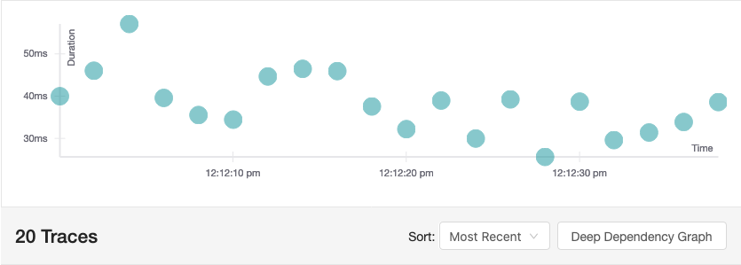

# MQ Showcase

Mit IBM MQ kann Pub/Sub auf zwei Arten realisiert werden - mit Topics oder mit Queues. Der Showcase zeigt beide Ansätze unter Verwendung 
eines IBM MQ Brokers und einer Reihe von JEE Anwendungen die JMS mit Hilfe des IBM MQ Resource Adapters integrieren. Die Anwendungen stehen
als Maven Module zur Verfügung und werden als Docker Container bereitgestellt. Weitere Informationen zu den Grundlagen finden sich 
[hier](PubSub.md).

Um die Nachrichten, die zwischen den Anwendungen übertragen werden, nachverfolgen zu können, wurde der Showcase um einen 
[Jaeger](https://www.jaegertracing.io) Server erweitert. Die Traces werden über 
[MP OpenTracing](https://microprofile.io/project/eclipse/microprofile-opentracing) bereitgestellt, das sowohl in die Producer als Consumer 
integriert wurde. 


**relevante Features**

* IBM MQ Broker
* JMS-Integration in Open Liberty mit Hilfe des IBM MQ Resource Adapters
* Queue/Topic Konfiguration über Environment-Variablen beim Start der Anwendung
* Automatische Fehlerhandling mit Hilfe von Backout Queues
* Integration von MP OpenTracing


## Showcase ausführen

#### Schritt 1: Docker Images erstellen 

Benötigte Software:
* `maven`
* `openjdk-8` (oder andere JDK 8)
* `docker`

Führt man die Phase `package` des Maven Lifecycle aus, wird neben dem _war_-Archiv, durch das `liberty-maven-plugin` auch ein ausführbare 
JAR Dateien erstellt, welches sowohl die Anwendung als auch den Applition Server enthalten. Direkt im Anschluss wird jede JAR Datei mit 
Hilfe von Spotify's `dockerfile-maven-plugin` in ein eigenes Docker Image kopiert und bereitgestellt.

Dazu muss man folgenden Befehl ausführen:

```shell script
$ mvn clean package
```

#### Schritt 2: Docker Container starten

Nachdem die Docker Images erstellt wurden, können die Container gestartet werden. Die `docker-compose.yml` enthält alle erforderlichen 
Container um den Showcase zu starten.

* IBM MQ Broker von IBM
* die JEE Anwendung `queue-producer`, enthält einen JMS Producer der Nachrichten in eine JMS Queue schreibt. Die Konfiguration für die 
angebundene JMS Queue muss beim Start des Docker Containers als Environment-Variable übergeben werden.
* die JEE Anwendung `queue-consumer`, enthält einen JMS Consumer der Nachrichten aus einer JMS Queue konsumiert. Die Konfiguration für 
die zu konsumierende JMS Queue muss beim Start des Docker Containers als Environment-Variable übergeben werden.
* die JEE Anwendung `topic-producer`, enthält einen JMS Producer der Nachrichten in ein JMS Topic schreibt. Die Konfiguration für das 
angebundene JMS Topic muss beim Start des Docker Containers als Environment-Variable übergeben werden.
* die JEE Anwendung `topic-consumer`, enthält einen JMS Consumer der Nachrichten aus einem JMS Topic konsumiert. Die Konfiguration für 
das zu konsumierende JMS Topic muss beim Start des Docker Containers als Environment-Variable übergeben werden.
* die JEE Anwendung `dlq-consumer`, enthält einen JMS Consumer der Nachrichten aus einer Dead Letter Queue oder Backout Queue konsumiert. 
Die Konfiguration für die zu konsumierende Backout Queue bzw. die Dead Letter Queue muss beim Start der Docker Containers als 
Environment-Variable übergeben werden.

Um die Container zu starten, muss man folgenden Befehl ausführen (**HINWEIS: Aus Performanzgründen empfiehlt es sich aber nur einzelne 
Container zu starten.**): 

```shell script
$ docker-compose up
```

Um den MQ Broker, den Queue Producer, drei Queue Consumer und den DLQ Consumer zu starten, muss man folgenden Befehl ausführen:

```shell script
$ docker-compose up mq-broker jaeger-server queue-producer queue-consumer-1 queue-consumer-2 queue-consumer-3 dlq-consumer
```

Um den MQ Broker, den Topic Producer, einen durable und einen non-durable Topic Consumer sowie den DLQ Consumer zu starten, muss man 
folgenden Befehl ausführen:

```shell script
$ docker-compose up mq-broker jaeger-server topic-producer topic-consumer-durable topic-consumer-nondurable dlq-consumer
```

Um den MQ Broker, den Topic Producer, zwei shared Topic Consumer sowie den DLQ Consumer zu starten, muss man 
folgenden Befehl ausführen:

```shell script
$ docker-compose up mq-broker jaeger-server topic-producer topic-consumer-shared-a topic-consumer-shared-b dlq-consumer
```

#### Schritt 3: Nachrichten Versenden und Empfangen

Es gibt zwei Möglichkeiten die Brücke zwischen Kafka und MQ zu testen. 

1) Die Anwendungen `queue-producer` und `topic-producer` enthalten einen Nachrichtengenerator, der alle zwei Sekunden eine neue 
Nachricht erzeugt und versendet. Der Empfang und die erfolgreiche Verarbeitung der Nachricht kann in der Log-Ausgabe der Anwendungen 
`queue-consumer` bzw. `topic-consumer` nachvollzogen werden.

2) Zusätzlich zum Nachrichtengenerator verfügt beide Producer Anwendungen über eine REST Schnittstelle, mit deren Hilfe eigene Nachrichten 
erzeugt und versendet werden können. 

Um eine eigene Nachricht an die JMS Queue zu versenden muss man den folgenden GET-Request senden:

```shell script
$ curl -X GET http://localhost:9080/queue-producer/api/messages?msg=<custom message>
```

Um eine eigene Nachricht an das JMS Topic zu versenden muss man den folgenden GET-Request senden:

```shell script
$ curl -X GET http://localhost:9081/topic-producer/api/messages?msg=<custom message>
```

#### Schritt 4: MQ Dashboard aufrufen

Der MQ Broker stellt ein Dashboard zur Verfügung, das unter https://localhost:9443/ibmmq/console/login.htm erreichbar ist.

* username: admin
* password: passw0rd


### Fehlerbehebung

Hin und wieder kommt es vor, dass die Docker Container beim Versuch vorzeitig zu beenden, nicht wie erwartet gestoppt werden. Dies kann dazu
führen, dass einzelne Container immer noch laufen, obwohl sie bereits gestoppt und entfernt hätten sein sollen. Um zu erkennen welche 
Docker Container noch laufen, muss man den folgenden Befehl ausführen:

```shell script
$ docker ps -a | grep <id of the container>
```

Wenn Container übrig bleiben, obwohl die Anwendung bereit angehalten wurde, kann man diese mit dem folgenden Befehl entfernen:

```shell script
$ docker rm <ids vom container>
```

#### Ausfall des MQ Brokers

Eine temporäre Nicht-Verfügbarkeit bzw. der Ausfall des MQ Brokers bringt auch für die verbundenen Producer und Consumer Konsequenzen mit 
sich. Während sich Producer automatisch erneut mit dem Broker verbinden, müssen alle Consumer neugestartet werden, um die Verbindung wieder
herzustellen.

Zu Beachten ist auch, dass Nachrichten die während der Abwesenheit des Brokers versendet werden, durch den Producer **nicht** gecacht 
werden. Der Producer muss daher eine eigene Lösung vorsehen um Nachrichten zwischenzuspeichern und nach dem erneuten Verbindungsaufbau mit 
dem Broker zu versenden.


## Features

### JMS-Integration in Open Liberty

Asynchrone Kommunikation in der Java-Welt erfolgt oftmals über JMS (Java Message Service). JMS ist eine standardisierte API für Messaging Systeme, die es Java EE Anwendungen ermöglicht, Nachrichten zu Erstellen, zu Senden, zu Empfangen und zu Lesen. JMS existiert bereits seit 2002 als Teil der Java Enterprise Plattform, jetzt Jakarta EE und wurde 2013 mit Java EE 7 grundlegend überarbeitet. Achtung: Anders als in vielen Fällen dargestellt, ist JMS kein standardisiertes Protokoll und legt auch kein Message-Format fest. Die Verwendung von JMS ermöglicht keineswegs den Einsatz heterogener Messaging-Systeme, sondern bildet lediglich eine Abstraktionsschicht auf die proprietären APIs der verschiedenen Message Broker. Das hat in der Regel zur Folge, dass unterschiedliche JMS Implementierung nicht interoperabel sind und somit auch nicht gemeinsam genutzt werden können.

Damit JMS genutzt von Java  werden kann, ist ein externer Provider erforderlich, der die JMS API implementiert und die Verbindung zum Message Broker bereitstellt. Bevor ein Java EE Application Server wie Open Liberty oder Wildfly mit einem Message Broker wie IBM MQ kommunizieren kann, muss der Application Server um einen produktspezifischen Resource Adapter erweitert werden.

Resource Adapter (.rar) sind Systembibliotheken, die die Konnektivität zwischen einem Application Server und einem Enterprise Information System (z.B. einem Message Broker) - kurz EIS - sicherstellen. Ein Resource Adapter für einen Message Broker ist quasi das Pendant zu einem produktspezifischen JDBC-Treiber für ein Datenbankmanagementsystem (z.B. IBM DB2 oder Oracle DB). Der Resource Adapter stellt die nahtlosen Verbindung zwischen EIS, Application Server und der Java EE Anwendung sicher.

In einem Application Server können mehrere Resource Adapter konfiguriert werden, um den ausgeführten Anwendungen Zugriff auf das jeweilige EIS zu gewähren. Der Application Server und das EIS arbeiten zusammen um alle Mechanismen auf Systemebene - Transaktionen, Sicherheit und Verbindungsverwaltung - für die ausgeführten Anwendung transparent bereitzustellen. Der Vorteil besteht darin, dass sich die ausgeführten Anwendung vollständig auf die Abbildung der Geschäftslogik konzentrieren kann und sich nicht um die mit der EIS-Integration verbundenen Probleme auf Systemebene kümmern muss.

weitere Informationen zu Resource Adaptern
* [Programming Resource Adapters](https://docs.oracle.com/cd/E13222_01/wls/docs92/resadapter/understanding.html)

#### Installation

Um auf einen IBM MQ Message Broker zuzugreifen, muss zunächst der Resource Adapter (_wmq.jmsra-9.1.4.0.rar_) im Open Liberty Server installiert werden. Hierzu wird der Resource-Adapter mit Hilfe von Maven während des Build-Prozesses in das _shared resources_ Verzeichnis des Open Liberty Application Servers kopiert (vgl. `target/liberty/wlp/usr/shared/resources`). Dabei handelt es sich um ein spezielles Verzeichnis für externe Bibliotheken, das Open Liberty beim Starten automatisch überwacht und alle dort befindlichen Bibliotheken installiert.

#### Konfiguration

Darüber hinaus muss der Resource Adapter in der server.xml konfiguriert werden. 

```xml
<resourceAdapter id="wmqjmsra" location="${shared.resource.dir}wmq.jmsra-9.1.4.0.rar"/>
```

##### Queue Konfiguration

Damit ein Producer Nachrichten an eine Queue senden kann, muss eine _ConnectionFactory_ und ein _Queue_ Objekt definiert werden. Die _jmsConnectionFactory_ definiert den Host und Port vom IBM MQ mit dem zur Queue zugehörigen Queue Manager und Channel.

```xml
<jmsConnectionFactory jndiName="JMSFactory">
  <properties.wmqjmsra
    transportType="CLIENT"
    hostName="${ibm.host}"                                              <!-- mq -->
    port="${ibm.port}"                                                  <!-- 1414 -->
    channel="${ibm.channel}"                                            <!-- DEV.ADMIN.SVRCONN -->
    queueManager="${ibm.qManager}"/>                                    <!-- QM1 -->
  <containerAuthData
    user="${secret.user}"                                               <!-- admin -->
    password="${secret.pass}"/>                                         <!-- passw0rd -->
</jmsConnectionFactory>
```

Für die Queue muss ein JNDI Name, mit dem JMS die Queue finden kann, erstellt werden.  
Außerdem wird ein _baseQueueName_ definiert, der den Namen der Queue beeinhaltet.

```xml
<jmsQueue id="jms/mdbq" jndiName="JMSQueue">
  <properties.wmqjmsra
    baseQueueName="${ibm.queue}"                                        <!-- DEV.QUEUE.ALIAS -->
    baseQueueManagerName="${ibm.qManager}"/>                            <!-- QM1 -->
</jmsQueue>
```

Für einen Consumer muss zusätzlich eine _jmsActivationSpec_ in der `server.xml` konfiguriert werden. Damit werden die Konfigurationen für die **Message Driven Beans** definiert.

```xml
<jmsActivationSpec id="queue-consumer/QueueConsumer">
  <properties.wmqjmsra
    destinationRef="jms/mdbq"
    destinationType="javax.jms.Queue"
    transportType="CLIENT"
    hostName="${ibm.host}"                                              <!-- mq -->
    port="${ibm.port}"                                                  <!-- 1414 -->
    channel="${ibm.channel}"                                            <!-- DEV.ADMIN.SVRCONN -->
    queueManager="${ibm.qManager}"/>                                    <!-- QM1 -->
  <containerAuthData
    user="${secret.user}"                                               <!-- admin -->
    password="${secret.pass}"/>                                         <!-- passw0rd -->
</jmsActivationSpec>
```

##### Topic Konfiguration

Die Konfiguration für ein Topic erfolgt analog zur Queue. Statt der _jmsConnectionFactory_ und der _jmsQueue_ muss eine _jmsTopicConnectionFactory_ und ein _jmsTopic_ definiert werden.

```xml
<jmsTopicConnectionFactory jndiName="JMSTopicFactory">
  <properties.wmqjmsra
    transportType="CLIENT"
    hostName="${ibm.host}"                                              <!-- mq -->
    port="${ibm.port}"                                                  <!-- 1414 -->
    channel="${ibm.channel}"                                            <!-- DEV.ADMIN.SVRCONN -->
    queueManager="${ibm.qManager}"/>                                    <!-- QM1 -->
  <containerAuthData
    user="${secret.user}"                                               <!-- admin -->
    password="${secret.pass}"/>                                         <!-- passw0rd -->
</jmsTopicConnectionFactory>
```

Für das Topic muss ein JNDI Name, mit dem JMS den Topic finden kann, erstellt werden.  
Außerdem wird ein _baseTopicName_ definiert, der den Topicnamen beeinhaltet.

```xml
<jmsTopic id="jms/mdbq" jndiName="JMSTopic">
    <properties.wmqjmsra baseTopicName="${ibm.topic}"/>                 <!-- DEV.BASE.TOPIC -->
</jmsTopic>
```

Für einen Subscriber muss zusätzlich eine _jmsActivationSpec_ in der `server.xml` konfiguriert werden. Damit werden die Konfigurationen für die **Message Driven Beans** definiert.

```xml
<jmsActivationSpec id="topic-consumer/TopicConsumer">
  <properties.wmqjmsra
    destinationRef="jms/mdbq"
    destinationType="javax.jms.Topic"
    transportType="CLIENT"
    hostName="${ibm.host}"                                              <!-- mq -->
    port="${ibm.port}"                                                  <!-- 1414 -->
    channel="${ibm.channel}"                                            <!-- DEV.ADMIN.SVRCONN -->
    queueManager="${ibm.qManager}"/>                                    <!-- QM1 -->
  <containerAuthData
    user="${secret.user}"                                               <!-- admin -->
    password="${secret.pass}"/>                                         <!-- passw0rd -->
</jmsActivationSpec>
```

**Shared Subscription**

Um eine _shared Subscription_ zu konfigurieren, muss die `jmsActivationSpec` für den Subscriber zusätzlich mit folgendem Parameter erweitert werden:

```xml
subscriptionName="${ibm.subName}"                                       <!-- shared-sub -->
```

#### Implementierung

Um in einer Java EE Anwendung Nachrichten an ein Topic oder eine Queue senden zu können muss ein Producer implementiert werden. Für das Empfangen wird ein Subscriber mit Hilfe einer _Message Driven Bean_ implementiert. 

##### JMS Queue Producer

```java
@ApplicationScoped
public class QueueProducer {
 
  private static final Logger LOG = LoggerFactory.getLogger(QueueProducer.class);
 
  @Resource(lookup = "JMSFactory")
  private ConnectionFactory jmsFactory;

  @Resource(lookup = "JMSQueue")
  private Queue queue;

  public void send(final CustomMessage message) {
    try (Connection connection = jmsFactory.createConnection();
        Session session = connection.createSession();
        MessageProducer producer = session.createProducer(queue)) {

      String json = JsonbBuilder.create().toJson(message);

      TextMessage textMessage = session.createTextMessage();
      textMessage.setText(json);

      LOG.info("Send message {} to queue {}", textMessage.getText(), queue.getQueueName());

      producer.send(textMessage);
    } catch (JMSException e) {
      LOG.error(e.getMessage(), e);
    }
  }
}
```

Die Connection und Topic Definition sind in einer JNDI Resource hinterlegt. Mit der Annotation `@Resource(lookup = "JMSFactory")` wird ein _ConnectionFactory_ Objekt injected, womit eine Verbindung zum IBM MQ Service erstellt wird.

```java
@Resource(lookup = "JMSFactory")
private ConnectionFactory jmsFactory;
```

Als nächstes muss ein _Queue_ Objekt aus dem JNDI Name erstellt.

```java
@Resource(lookup = "JMSQueue")
private Queue queue;
```

Im nächsten Schritt muss ein Producer aus der ConnectionFactory erstellt werden.

```java
try (Connection connection = jmsFactory.createConnection();
        Session session = connection.createSession();
        MessageProducer producer = session.createProducer(queue))
```

Nun kann man eine Nachricht erstellen, welches an die konfigurierte Queue gesendet wird.

```java
TextMessage textMessage = session.createTextMessage();
textMessage.setText(json);
```

##### JMS Topic Producer

```java
@ApplicationScoped
public class TopicProducer {
 
  private static final Logger LOG = LoggerFactory.getLogger(TopicProducer.class);
 
  @Resource(lookup = "JMSTopicFactory")
  private TopicConnectionFactory jmsFactory;

  @Resource(lookup = "JMSTopic")
  private Topic topic;

  public void send(final CustomMessage message) {
    try (Connection connection = jmsFactory.createConnection();
        Session session = connection.createSession();
        MessageProducer producer = session.createProducer(topic)) {

      String json = JsonbBuilder.create().toJson(message);

      TextMessage textMessage = session.createTextMessage();
      textMessage.setText(json);

      LOG.info("Send message {} to topic {}", textMessage.getText(), topic.getTopicName());

      producer.send(textMessage);
    } catch (JMSException e) {
      LOG.error(e.getMessage(), e);
    }
  }
}
```

Die Connection und Topic Definition sind in einer JNDI Resource hinterlegt. Mit der Annotation `@Resource(lookup = "JMSTopicFactory")` wird ein _TopicConnectionFactory_ Objekt injected, womit eine Verbindung zum IBM MQ Service erstellt wird.

```java
@Resource(lookup = "JMSTopicFactory")
private TopicConnectionFactory jmsFactory;
```
Als nächstes muss ein _Topic_ Objekt aus dem JNDI Name erstellt.

```java
@Resource(lookup = "JMSTopic")
private Topic topic;
```
Im nächsten Schritt muss ein Producer aus der ConnectionFactory erstellt werden.

```java
try (Connection connection = jmsFactory.createConnection();
        Session session = connection.createSession();
        MessageProducer producer = session.createProducer(topic))
```
Nun kann man eine Nachricht erstellen, welches an das konfigurierte Topic gesendet wird.

```java
TextMessage textMessage = session.createTextMessage();
textMessage.setText(json);
```

##### JMS Queue / Topic Consumer

Die Implementierung eines JMS Consumers in Form einer _Message Driven Bean_ ist für Queues/Topics identisch. Solange nur eine Queue bzw. ein Topic definiert wird, kann mit der Annotation `@MessageDriven` ein Consumer definiert werden. Zusätzlich muss der Consumer das _MessageListener_ Interface implementieren. Hierzu wird die Methode _onMessage(Message message)_ überschrieben, welche vom Resource Adapter aufgerufen wird, sobald eine Nachricht an die Queue bzw. das Topic gesendet und vom Consumer gelesen wird.

```java
@MessageDriven
public class QueueConsumer implements MessageListener {
 
  private static final Logger LOG = LoggerFactory.getLogger(QueueConsumer.class);
 
  @Override
  public void onMessage(Message message) {
    try {
      String text = ((TextMessage)message).getText();
 
      LOG.info("Received message: {}", text);
      
      ...
      
    } catch (JMSException e) {
      LOG.error(e.getMessage(), e);
    }
  }
}
```

**Durable Consumer**

Subscriber können eine _durable Subscription_ erstellen, wodurch Nachrichten auf Seiten von MQ persistiert werden. Ist der Consumer offline, hält MQ die Nachrichten vor, bis Subscriber wieder online ist. 

Um eine _durable Subscription_ zu erstellen, muss diese in der _Message Driven Bean_ über die Annotation `@MessageDriven` konfiguriert werden. Für eine _durable Subscription_ müssen über die Annotation `@ActivationConfigProperties` folgende Properties gesetzt werden.

* die Property _subscriptionDurability_ muss auf _Durable_ gesetzt werden
* der Subscriber muss eine eindeutige _clientId_ erhalten
* für den Subscriber muss ein eindeutiger _subscriptionName_ vorhanden sein

```java
@MessageDriven(activationConfig = {
    @ActivationConfigProperty(propertyName = "subscriptionDurability", propertyValue = "Durable"),
    @ActivationConfigProperty(propertyName = "clientId", propertyValue = "topic-consumer-durable"),
    @ActivationConfigProperty(propertyName = "subscriptionName", propertyValue = "durable-subscription")
})
public class DurableTopicConsumer implements MessageListener {
  ...
}
```

**Shared Subscription**

Neben der Konfiguration in der `server.xml` muss für eine _shared Subscription_ auch eine Konfiguration in der _Message Driven Bean_ erfolgen. Dies erfolgt analog zur _durable Subscription_ über die Annotation `@MessageDriven`.

Um die _shared Subscription zu aktivieren wird die über die Annotation `@ActivationConfigProperties` die Property _sharedSubscription_ auf `TRUE` gesetzt. _Shared Subscriptions_ können sowohl _durable_ als auch _non-durable_ sein. Die Konfiguration erfolgt über die Property _subscriptionDurability_.

```java
@MessageDriven(activationConfig = {
    @ActivationConfigProperty(propertyName = "subscriptionDurability", propertyValue = "Durable"),
    @ActivationConfigProperty(propertyName = "sharedSubscription", propertyValue = "TRUE")
})
public class SharedTopicConsumer implements MessageListener {
  ...
}
```


### Nachrichten mit OpenTracing und Jaeger verfolgen

Tracing erlaubt es den Datenfluß über mehrere Systeme hinweg zu verfolgen und die Verarbeitungsdauer in einem System zu messen. Eine 
Anfrage wird mit einem _Trace_ abgebildet. Darüber hinaus wird jeder Methodenaufruf innerhalb des Systems in einem _Span_ aufgezeichnet. Da
es bei nachrichten-basierten Kommunikation keine direkte Verbindung zwischen den Producer und Consumer gibt, stellt Tracing eine einfache 
und effektive Möglichkeit dar, den Weg einer Nachricht zu verfolgen und Abhängigkeiten zwischen lose gekoppelten Systemen zu erkennen. Die 
Basis hierfür bilden der OpenTracing Standard und verteilte Tracing-Systeme wie Jaeger.


[OpenTracing](http://opentracing.io/) ist ein neuer, offener Standard zur Ablaufverfolgung für verteilte Anwendungen. Entwickler mit 
Erfahrung im Aufbau von großen Mikroservice Umgebungen, Wissen um die Notwendigkeit und Bedeutung des verteilten Tracings: Logging auf 
Prozessebene und Monitoring von Metriken (Geschäftskennzahlen) sind in verteilten Systemen unverzichtbar, jedoch kann mit keinem der beiden
Ansätze die Spuren in Form Aufrufen und Nachrichten rekonstruieren, die eine einzelne Transaktion in einem verteilten System hinterlässt.

Die [MicroProfile OpenTracing](https://microprofile.io/project/eclipse/microprofile-opentracing) Spezifikation definiert das Verhalten und 
eine API für den Zugriff auf ein OpenTracing-konformes Tracer-Objekt innerhalb einer Anwendung. Die Spezifikation legt fest, in welcher 
Weise OpenTracing Spans für eingehende und ausgehende Anfragen automatisch erstellt werden. Die API definiert darüber hinaus, wie die 
Ablaufverfolgung für bestimmte Endpunkte explizit deaktiviert oder aktiviert werden kann.

[Jaeger](https://www.jaegertracing.io) ist ein verteiltes Tracing-System, das von Uber Technologies entwickelt und als Open Source Projekt 
veröffentlicht wurde. Jaeger wird die für Überwachung und Fehlerbehebung in verteilten Systemen (insbesondere Mikroservice-Architekturen) 
einschließlich verteilter Kontextpropagierung und Transaktionsüberwachung, Fehleranalyse, Abhängigkeitsanalyse sowie Performanz-und 
Latenzoptimierung genutzt.

Der Jaeger-Server stellt eine eigene UI zur Verfügung, die unter http://localhost:16681/ erreichbar ist. 

Das Senden einer Nachricht durch einen `queue-producer` bzw. `topic-producer` und deren Konsumierung durch einen `queue-consumer` bzw. 
`topic-consumer`, führt zur Generierung mehrerer Traces aus denen der Jaeger Server einen Abhängigkeitsgraphen erzeugt. Der erzeugte Graph 
weist eine Verbindung zwischen den jeweils beteiligten Anwendungen aus. 



Hier werden alle Traces, die in den letzten 20 Minuten angefallen sind, in einem Dauer-Zeit Diagramm gezeichnet werden

#### Implementierung

Der `jaeger-client` wird über die folgenden Environment-Variable konfiguriert, die beim Start des Docker Containers übergeben werden:

* `JAEGER_AGENT_HOST` Pfad zum Jaeger Host
* `JAEGER_SERVICE_NAME` Name des Client
* `JAEGER_REPORTER_LOG_SPANS` Ob der Span geloggt werden soll
* `JAEGER_SAMPLER_TYPE` Art des Tracers

Das `MP OpenTracing` legt fest, dass für jede Anfragen an eine JAX-RS Ressourcen automatisch ein _Span_ erzeugt wird, so das man sich als 
Entwickler nicht weiter darum kümmern muss. Will man jedoch Traces für nachrichten-basierten Kommunikation erstellen muss dies manuell 
erfolgen. 

Um manuell einen _Span_ zu erzeugten, benötigt man ein _Tracer_. Diesen kann man sich via Dependency Injection in seine Klasse injizieren 
lassen oder oder im Code über die Konfiguration `Configuration.fromEnv().getTracer()` abfragen. 

Das Tracing beginnt mit der Erzeugung des _Spans_ (idealerweise direkt nach dem Methodenaufruf) und muss vor dem Verlassen der Methoden 
auch wieder beendet werden. Da für jeden Methodenaufruf, ob lokal oder über das Netzwerk, ein neuer _Span_ erstellt werden muss, kann man
die _Trace ID_, die jeder _Span_ enthält, weiterleiten. Mittels `tracer.activeSpan()` greift man auf den aktuellen _Span_ (in diesem Fall 
auch _Parent-Span_ genannt) zu und erzeugt einen neuen _Child-Span_. Auf Basis der _Trace ID_ werden somit eine ganze Reihe von 
_Child-Spans_ erzeugt, anhand derer sich der Datenfluß lückenlos nachvollziehen lässt.

```java
public class ClassToTrace {

  @Inject
  private Tracer tracer;

  public void methodToTrace() {
    Span span = tracer.buildSpan("method_to_trace")
                      .asChildOf(tracer.activeSpan())
                      .start();

    //...

    span.finish();
  }
}
```

Da das Erstellen und Beenden der _Spans_ für alle Methoden sehr ähnlich ist, kann der Code in einen _CDI-Interceptor_ auslagert werden. 

```java
@Tracing
@Interceptor
public class TracingInterceptor implements Serializable {

  private static final long serialVersionUID = 1L;

  private static final Logger LOG = LoggerFactory.getLogger(TracingInterceptor.class);

  Tracer tracer =  Configuration.fromEnv().getTracer();

  @AroundInvoke
  public Object trace(InvocationContext ctx) throws Exception {

    Message message = (Message)ctx.getParameters()[0];

    Span span = createSpan(message);

    Object proceed = ctx.proceed();

    span.finish();

    return proceed;
  }

  /**
   * Die TraceID wird über die Header als Property weitergegeben. Jaeger nutzt die "uber-trace-id" property.
   * Im JMS Standart sind keine Bindestriche in Headerproperties erlaubt. Deswegen müssen die Bindestriche durch
   * "_$dash$_" ersetzt werden
   */
  private Span createSpan(final Message message) throws JMSException {
    Map<String, String> map = new HashMap<>();
    String traceID = message.getStringProperty("uber_$dash$_trace_$dash$_id");
    map.put("uber-trace-id", traceID);

    SpanContext spanContext = tracer.extract(Format.Builtin.TEXT_MAP, new TextMapExtractAdapter(map));

    return tracer.buildSpan("on_message").asChildOf(spanContext).start();
  }
}
```

Um den Interceptor und somit das Tracing für eine Methode zu aktivieren, müssen mit der Annotation `@Tracing` annotatiert werden. 

```java
@Inherited
@InterceptorBinding
@Retention(RUNTIME)
@Target({ METHOD, TYPE })
public @interface Tracing {
}
```